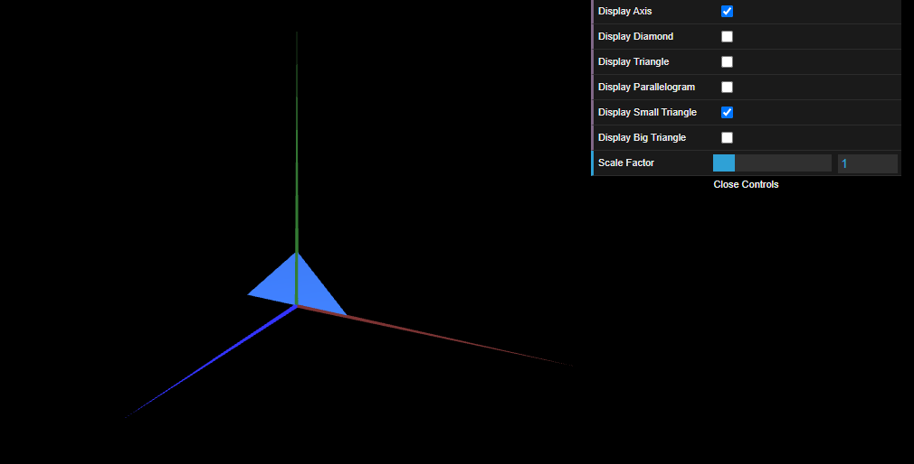
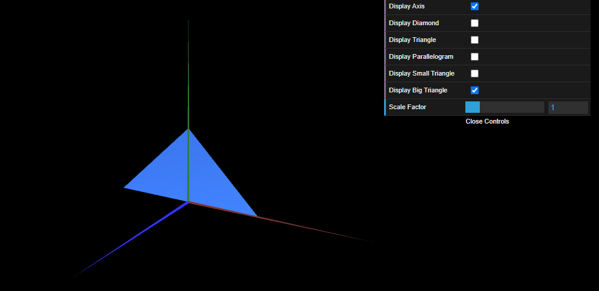

# CG 2024/2025

## Group T03G07

## TP 1 Notes

- In exercise 1 we created a new subclass of CGFobject called MyTriangle to define a right-angled triangle in the XY plane with a side length of 2 units, following the structure of MyDiamond. After this, two checkboxes were added to the GUI in MyInterface to toggle the visibility of both the diamond and the triangle. Additionally, the MyParallelogram subclass was implemented, creating a double-sided parallelogram along with another checkbox to control its visibility.
- In exercise 2, we observed the creation of two new subclasses of CGFobject: MyTriangleSmall and MyTriangleBig, representing a small and a large right-angled triangle, respectively, as shown in the following figures. These shapes were implemented following the existing structure and integrated into the scene.

