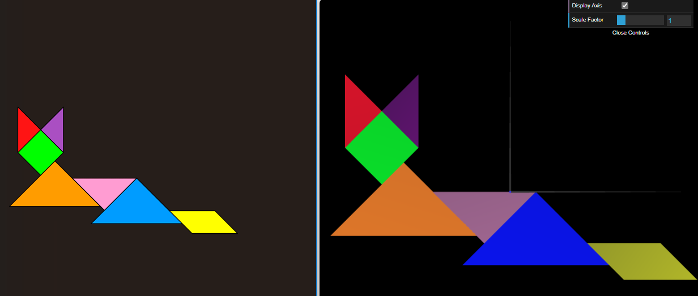
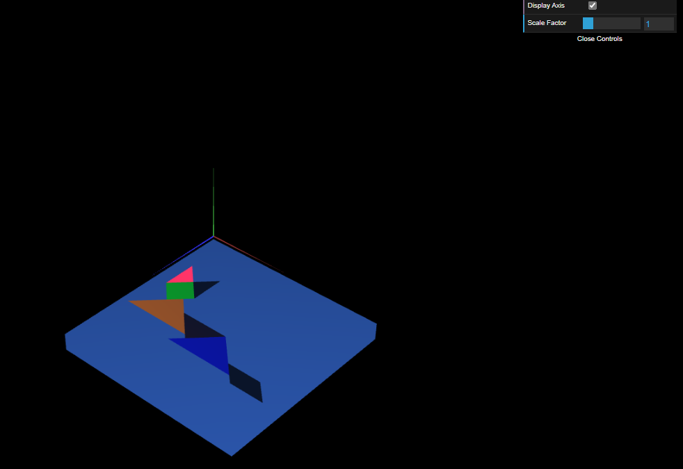
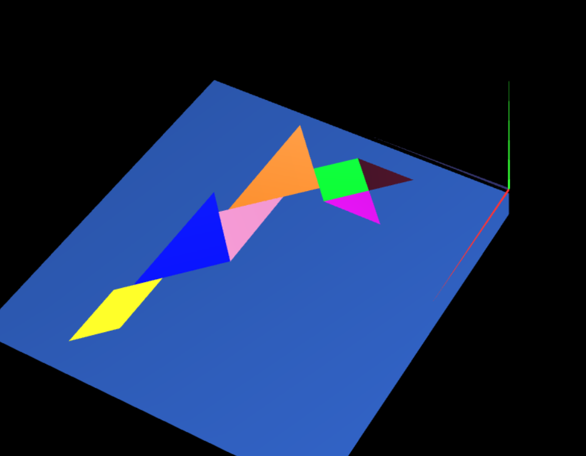

# CG 2024/2025

## Group T03G07

## TP 2 Notes

- In exercise 1, we observed how geometric transformations, such as translation, rotation, and scaling, can be applied to 3D objects using both matrix multiplication and WebCGF functions. By utilizing these transformations, we positioned various Tangram pieces in the scene, ensuring they were centered around the origin. We also created a MyTangram class to group the pieces together and display them using the appropriate transformations, simplifying the process of rendering the complete Tangram figure in WebGL.

- In exercise 2, we constructed a unit cube centered at the origin (−0.5,−0.5,−0.5) to (0.5,0.5,0.5) using a single mesh of triangles. A MyUnitCube class was created, extending CGFobject, with defined vertices and connectivity. After importing it into MyScene.js, an instance was added and displayed. Finally, the Tangram was reactivated and the necessary transformations were applied to position the cube as a base behind it, aligning the structure parallel to the XZ plane with the base’s upper-left vertex at the origin.

- In exercise 3, we created a unit cube using planes, defining each face with a MyQuad class. The MyUnitCubeQuad class used multiple MyQuad instances to form the cube, applying geometric transformations to position the faces correctly. After implementing and displaying the cube, it was positioned behind the Tangram figure as a base. Transformations were applied to align the cube parallel to the XZ plane, with the base’s upper-left vertex at the origin.

