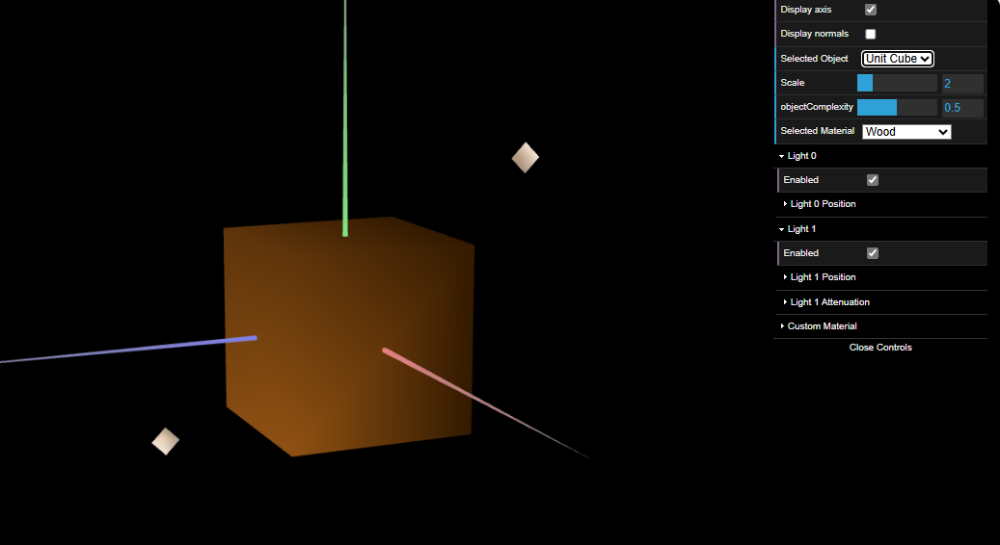
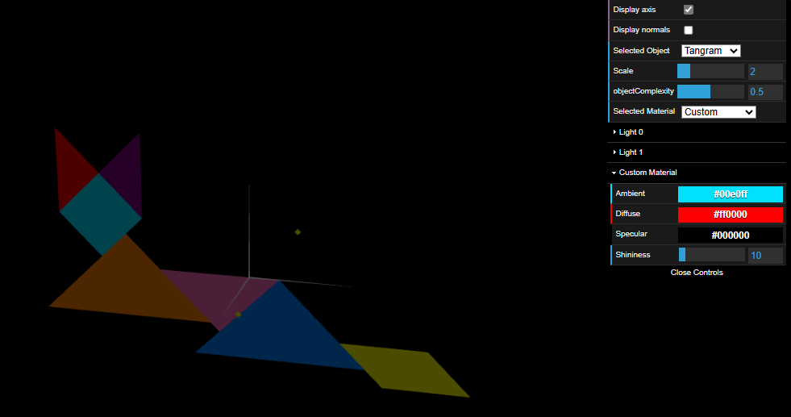
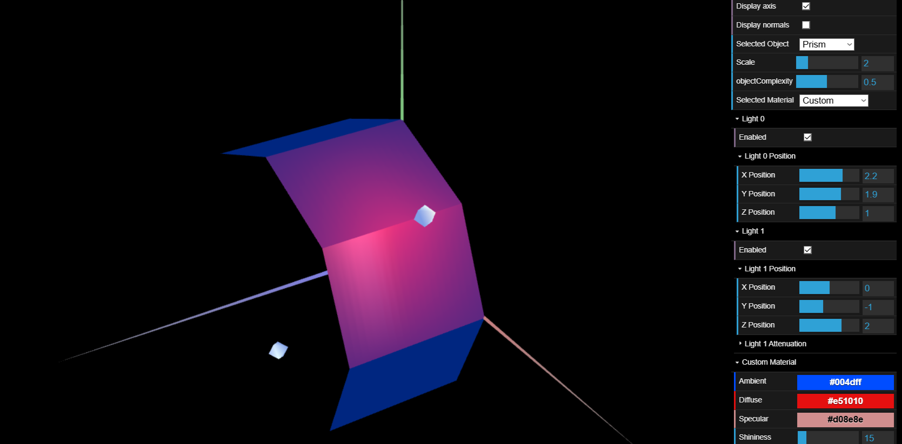
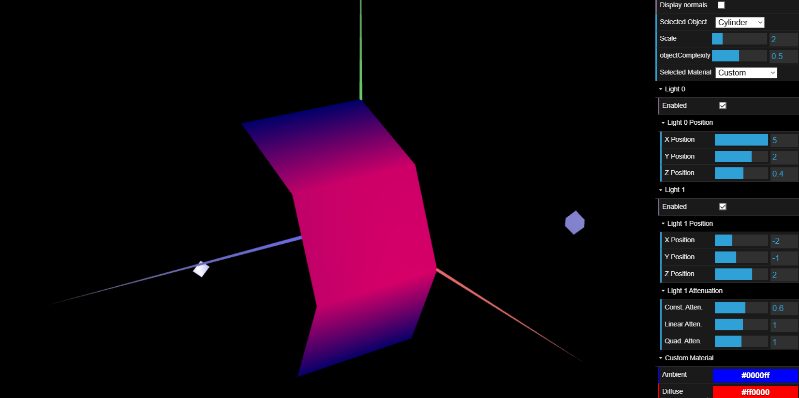

# CG 2024/2025

## Group T03G07

## TP 3 Notes

- In exercise 1, we observed lighting inconsistencies due to missing normals in MyTangram and MyUnitCube. To fix this, we defined normals in initBuffers(), ensuring correct shading. We also created a wood-like material with low specular reflection and tested it on the cube as shown in the following figure: 

- In exercise 1, we also assigned high-specular materials to each Tangram piece with colors matching the reference image. Additionally, we applied the ‘Custom’ material, controllable via the interface, to the MyDiamond piece.

- In exercise 2, we implemented MyPrism.js, which generates a prism with a configurable number of slices (vertical divisions) and stacks (horizontal divisions). The prism is inscribed in a cylinder of radius 1 and height 1. Each face has independent normals, making the shading flat and causing visible edges between faces. The object was tested in MyScene with 8 slices and 20 stacks, representing a vertical column.

- In exercise 3, we created MyCylinder.js, modifying MyPrism.js to ensure that shared vertices on adjacent faces have the same normal, making them perpendicular to the ideal cylindrical surface. This change smooths the lighting transitions and removes harsh edges, creating a more natural curved appearance. To optimize performance, duplicate vertices and normals were eliminated. The final object was imported into MyScene, where it was tested with 8 slices and 20 stacks.

The implementation was verified by observing the effects of Gouraud shading, confirming that the cylinder appears smooth with improved light reflection, making the edges less noticeable.