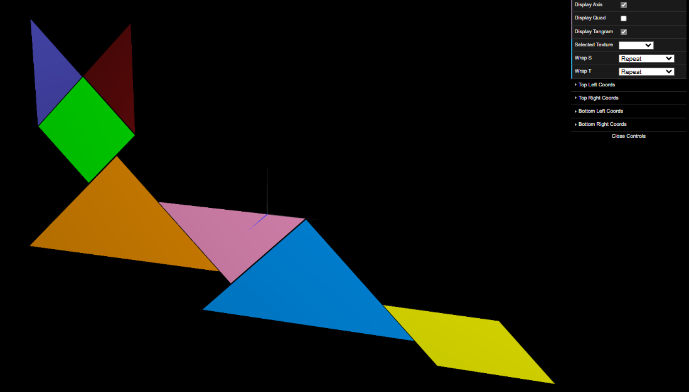
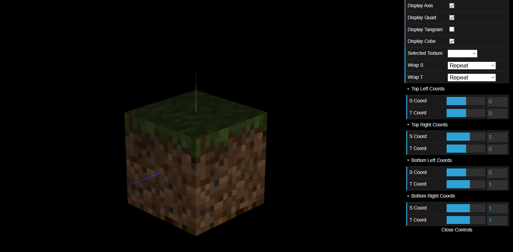

# CG 2024/2025

## Group T03G07

## TP 4 Notes

- In tasks 1, 2, and 3 we determined the correct texture coordinates by analyzing the image and aligning the edges of the figures (diamond, parallelogram and triangles) with its representation in the texture (tangram.png). This process involved defining the this.texCoords array in the initBuffers function of each figure, assigning appropriate (s, t) coordinates for each vertex. The same approach was applied to all the Tangram pieces, ensuring that each shape correctly displayed its corresponding section of the tangram.png texture.

- In this task, we applied textures to a cube using the MyUnitCubeQuad class. The constructor was modified to accept six optional textures for each face: top, front, right, back, left, and bottom. In the display() function, each texture was bound before rendering its face, ensuring correct application. We also set the texture filtering mode to NEAREST using texParameteri() to maintain a pixelated look instead of the default smoothing effect. An instance of MyUnitCubeQuad was created with 'mineSide.png' for the side faces, 'mineTop.png' for the top, and 'mineBottom.png' for the bottom. These modifications ensured proper texture alignment and visual clarity.

