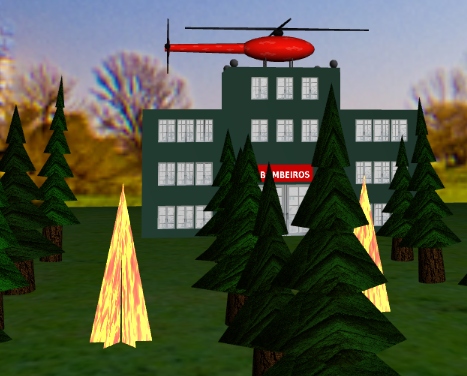
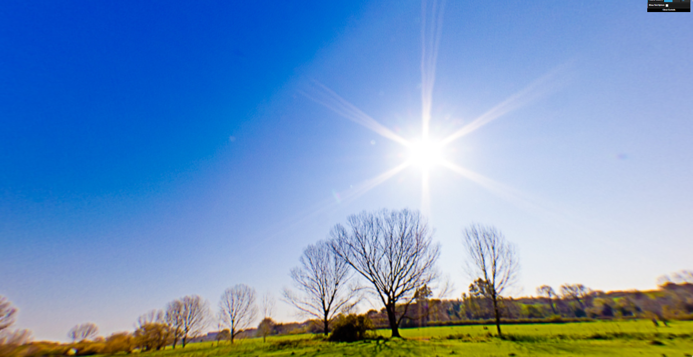
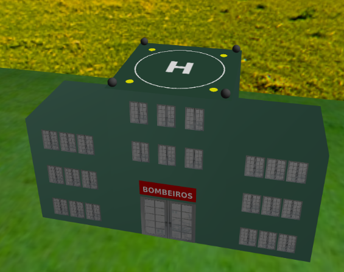
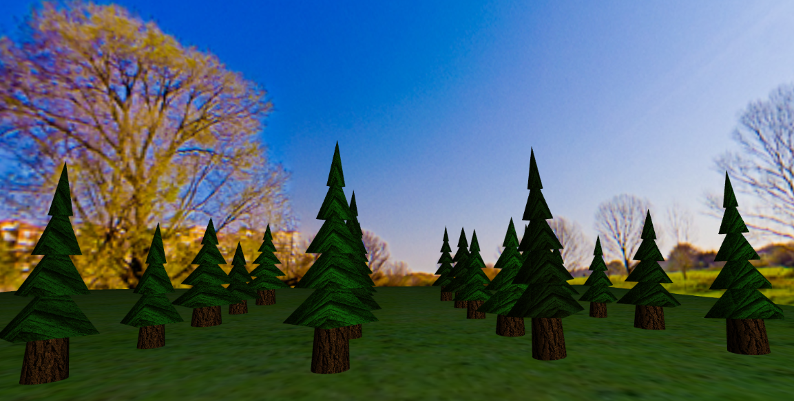
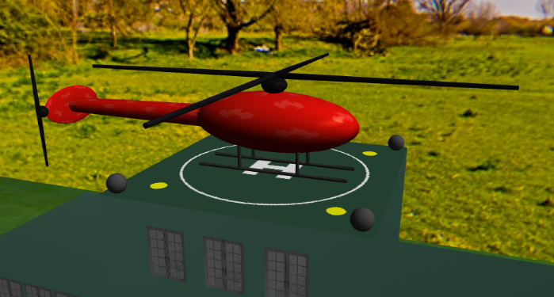
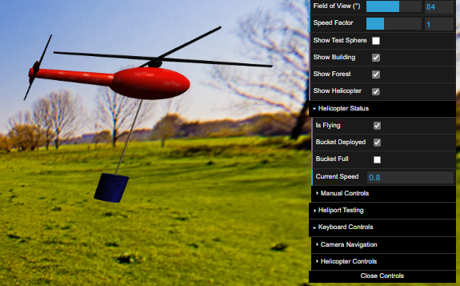
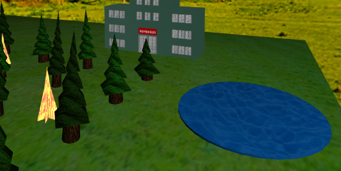
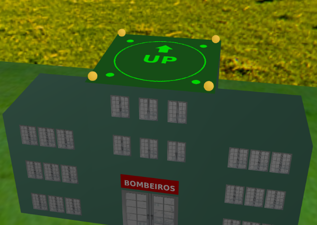
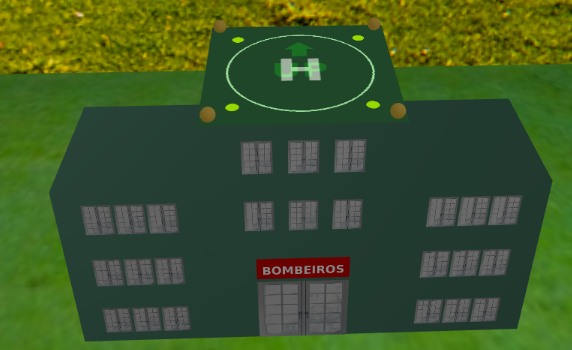

# CG 2024/2025

## Group T03G07

| Name             | Number    | E-Mail             |
| ---------------- | --------- | ------------------ |
| Beatriz Alexandra de Almeida Bernardo         | 202206097 | up202206097@up.pt                |
| Karlo Jagar         | 202411506 | up202411506@up.pt                |

----

# Firefighting helicopter scene - CG Project

This project implements an interactive 3D firefighting scene using WebCGF, integrating object modeling, animations, shaders and keyboard interaction. It follows all stages defined in the assignment and documents the key development milestones below.

## Milestone (1): Sphere creation and Sky-Sphere

* Created the `MySphere` class with stack/slice angular divisions.
* Generated correct texture coordinates and normal directions.
* Created `MyPanorama` class using an inverted `MySphere`, mapped with a panoramic 360° texture.
* Made the panorama follow the camera position to simulate infinite sky.

## Milestone (2): Fire station building

* Implemented `MyWindow` with configurable textures.
* Created `MyBuilding` with three modules: two side modules and one central (taller) module.
* Central module has a heliport (H texture), a front door and a "BOMBEIROS" sign.
* Number of floors  of side modules, windows per floor, total width of the building (set of the three modules), 
window type (texture) and color of the building are configurable.

## Milestone (3): Trees and Forest

* Created `MyTree` class with trunk (cone) and a canopy of pyramids.
* Parameters control height, trunk radius, canopy color and tilt.
* `MyForest` class generates a matrix of trees with random parameters and offsets.
* Trees use bark and leaf textures for realism.

## Milestone (4): Helicopter Modeling

* Created `MyHeli` composed of spheres and cylinders: cabin, tail boom, rotors, landing gear and a bucket.
* Applied materials and textures to parts.
* Helicopter starts positioned on the building's heliport.

## Milestone (5): Helicopter Animation and Controls

* `MyHeli` supports takeoff, landing, rotation, forward/backward motion.
* Uses keyboard keys: W/S (accelerate/brake), A/D (turn), R (reset), P (takeoff), L (land), O (drop water).
* Uses `turn()` and `accelerate()` with speedFactor from GUI.
* Cruise altitude is parameterized and the control is enabled only after reaching cruise height.
* Bucket becomes visible only after takeoff or during water pickup.

## Milestone (6): Water and Fire

* Implemented `MyFire` with animated flames made of triangles and fire textures.
* Implemented `MyLake` with a 2D surface and realistic texture.
* Helicopter detects when it's over the lake/fire.
* On "L", if stopped over the lake, descends vertically to collect water.
* On "P", if stopped with the bucket in the lake, ascends vertically with the bucket full of water.
* On "O", if over fire, drops water and extinguishes the fire.

## Milestone (7): Shaders and Animation

* Flames in `MyFire` animate with vertex displacement in shaders, using time and random variation.
* Heliport has animated texture transitions (H, UP, DOWN) using shaders.
* Added pulsating emissive corner lights on the heliport during takeoff and landing phases.

## Milestone (8): Shader-based Texture Mixing for Heliport

* Implemented blending of heliport textures ("H", "UP" and "DOWN") using a custom fragment shader.
* During takeoff and landing, the heliport texture transitions smoothly between the base texture and the directional indicators.
* The shader uses a blend factor parameter updated over time to interpolate between textures.
* This technique adds realism by avoiding abrupt texture changes.

---
